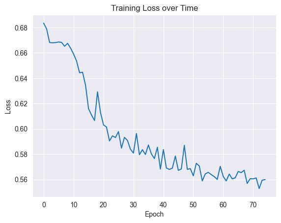
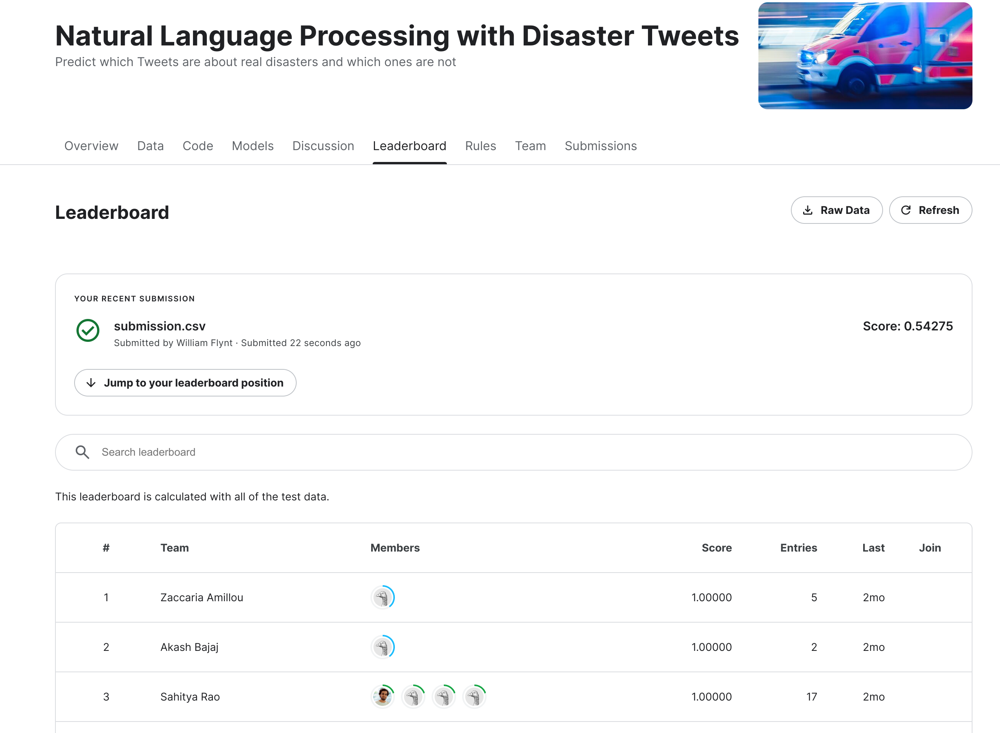

# `disaster-tweets`

Using RNN to classify tweets.

https://www.kaggle.com/c/nlp-getting-started/overview

## Notebook

[Notebook is right here.](./disaster-tweets.ipynb) It has notes about the data, model, methods, etc...

## How did it go?

It looks like it's working!!

But accuracy was... not great.

